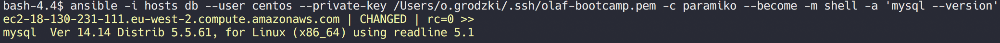

The hostname of your DB node

`ec2-18-130-231-111.eu-west-2.compute.amazonaws.com`

`ip-172-31-16-185.eu-west-2.compute.internal`

The command screenshot to display the DB version



The command and output for listing databases

```
[root@ip-172-31-16-185 ~]# mysql -u root -ppassword
Welcome to the MySQL monitor.  Commands end with ; or \g.
Your MySQL connection id is 6
Server version: 5.5.61-log MySQL Community Server (GPL)

Copyright (c) 2000, 2018, Oracle and/or its affiliates. All rights reserved.

Oracle is a registered trademark of Oracle Corporation and/or its
affiliates. Other names may be trademarks of their respective
owners.

Type 'help;' or '\h' for help. Type '\c' to clear the current input statement.

mysql> SHOW DATABASES;
+--------------------+
| Database           |
+--------------------+
| information_schema |
| amon               |
| hue                |
| metastore          |
| mysql              |
| oozie              |
| performance_schema |
| rman               |
| scm                |
| sentry             |
+--------------------+
10 rows in set (0.00 sec)

mysql>

```