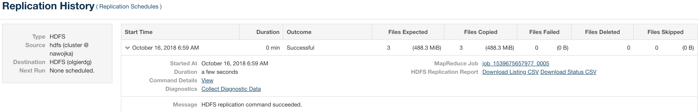

```
[hdfs@ip-172-31-46-123 ~]$ hadoop jar /opt/cloudera/parcels/CDH/jars/hadoop-examples.jar teragen 5120000 /tmp/olgierdg
18/10/16 08:15:01 INFO client.RMProxy: Connecting to ResourceManager at ip-172-31-35-238.eu-central-1.compute.internal/172.31.35.238:8032
18/10/16 08:15:01 INFO terasort.TeraSort: Generating 5120000 using 2
18/10/16 08:15:01 INFO mapreduce.JobSubmitter: number of splits:2
18/10/16 08:15:01 INFO mapreduce.JobSubmitter: Submitting tokens for job: job_1539675657977_0002
18/10/16 08:15:02 INFO impl.YarnClientImpl: Submitted application application_1539675657977_0002
18/10/16 08:15:02 INFO mapreduce.Job: The url to track the job: http://ip-172-31-35-238.eu-central-1.compute.internal:8088/proxy/application_1539675657977_0002/
18/10/16 08:15:02 INFO mapreduce.Job: Running job: job_1539675657977_0002
18/10/16 08:15:07 INFO mapreduce.Job: Job job_1539675657977_0002 running in uber mode : false
18/10/16 08:15:07 INFO mapreduce.Job:  map 0% reduce 0%
18/10/16 08:15:15 INFO mapreduce.Job:  map 100% reduce 0%
18/10/16 08:15:16 INFO mapreduce.Job: Job job_1539675657977_0002 completed successfully
18/10/16 08:15:16 INFO mapreduce.Job: Counters: 31
        File System Counters
                FILE: Number of bytes read=0
                FILE: Number of bytes written=246096
                FILE: Number of read operations=0
                FILE: Number of large read operations=0
                FILE: Number of write operations=0
                HDFS: Number of bytes read=167
                HDFS: Number of bytes written=512000000
                HDFS: Number of read operations=8
                HDFS: Number of large read operations=0
                HDFS: Number of write operations=4
        Job Counters
                Launched map tasks=2
                Other local map tasks=2
                Total time spent by all maps in occupied slots (ms)=12298
                Total time spent by all reduces in occupied slots (ms)=0
                Total time spent by all map tasks (ms)=12298
                Total vcore-seconds taken by all map tasks=12298
                Total megabyte-seconds taken by all map tasks=12593152
        Map-Reduce Framework
                Map input records=5120000
                Map output records=5120000
                Input split bytes=167
                Spilled Records=0
                Failed Shuffles=0
                Merged Map outputs=0
                GC time elapsed (ms)=158
                CPU time spent (ms)=13120
                Physical memory (bytes) snapshot=606392320
                Virtual memory (bytes) snapshot=5566685184
                Total committed heap usage (bytes)=674758656
        org.apache.hadoop.examples.terasort.TeraGen$Counters
                CHECKSUM=10993942703914404
        File Input Format Counters
                Bytes Read=0
        File Output Format Counters
                Bytes Written=512000000
```
# Distcp

```
[hdfs@ip-172-31-46-123 ~]$ hadoop distcp hdfs://ec2-18-194-208-128.eu-central-1.compute.amazonaws.com:8022/nawojka hdfs://ec2-18-196-102-174.eu-central-1.compute.amazonaws.com:8022/tmp/nawojka
18/10/16 08:29:39 INFO tools.DistCp: Input Options: DistCpOptions{atomicCommit=false, syncFolder=false, deleteMissing=false, ignoreFailures=false, overwrite=false, append=false, useDiff=false, useRdiff=false, fromSnapshot=null, toSnapshot=null, skipCRC=false, blocking=true, numListstatusThreads=0, maxMaps=20, mapBandwidth=100, sslConfigurationFile='null', copyStrategy='uniformsize', preserveStatus=[], preserveRawXattrs=false, atomicWorkPath=null, logPath=null, sourceFileListing=null, sourcePaths=[hdfs://ec2-18-194-208-128.eu-central-1.compute.amazonaws.com:8022/nawojka], targetPath=hdfs://ec2-18-196-102-174.eu-central-1.compute.amazonaws.com:8022/tmp/nawojka, targetPathExists=false, filtersFile='null'}
18/10/16 08:29:39 INFO client.RMProxy: Connecting to ResourceManager at ip-172-31-35-238.eu-central-1.compute.internal/172.31.35.238:8032
18/10/16 08:29:39 INFO tools.SimpleCopyListing: Paths (files+dirs) cnt = 4; dirCnt = 1
18/10/16 08:29:39 INFO tools.SimpleCopyListing: Build file listing completed.
18/10/16 08:29:39 INFO Configuration.deprecation: io.sort.mb is deprecated. Instead, use mapreduce.task.io.sort.mb
18/10/16 08:29:39 INFO Configuration.deprecation: io.sort.factor is deprecated. Instead, use mapreduce.task.io.sort.factor
18/10/16 08:29:40 INFO tools.DistCp: Number of paths in the copy list: 4
18/10/16 08:29:40 INFO tools.DistCp: Number of paths in the copy list: 4
18/10/16 08:29:40 INFO client.RMProxy: Connecting to ResourceManager at ip-172-31-35-238.eu-central-1.compute.internal/172.31.35.238:8032
18/10/16 08:29:40 INFO mapreduce.JobSubmitter: number of splits:3
18/10/16 08:29:40 INFO mapreduce.JobSubmitter: Submitting tokens for job: job_1539675657977_0003
18/10/16 08:29:40 INFO impl.YarnClientImpl: Submitted application application_1539675657977_0003
18/10/16 08:29:40 INFO mapreduce.Job: The url to track the job: http://ip-172-31-35-238.eu-central-1.compute.internal:8088/proxy/application_1539675657977_0003/
18/10/16 08:29:40 INFO tools.DistCp: DistCp job-id: job_1539675657977_0003
18/10/16 08:29:40 INFO mapreduce.Job: Running job: job_1539675657977_0003
18/10/16 08:29:45 INFO mapreduce.Job: Job job_1539675657977_0003 running in uber mode : false
18/10/16 08:29:45 INFO mapreduce.Job:  map 0% reduce 0%
18/10/16 08:29:50 INFO mapreduce.Job:  map 33% reduce 0%
18/10/16 08:29:53 INFO mapreduce.Job:  map 67% reduce 0%
18/10/16 08:29:54 INFO mapreduce.Job:  map 100% reduce 0%
18/10/16 08:29:55 INFO mapreduce.Job: Job job_1539675657977_0003 completed successfully
18/10/16 08:29:56 INFO mapreduce.Job: Counters: 33
        File System Counters
                FILE: Number of bytes read=0
                FILE: Number of bytes written=378282
                FILE: Number of read operations=0
                FILE: Number of large read operations=0
                FILE: Number of write operations=0
                HDFS: Number of bytes read=512001762
                HDFS: Number of bytes written=512000000
                HDFS: Number of read operations=56
                HDFS: Number of large read operations=0
                HDFS: Number of write operations=13
        Job Counters
                Launched map tasks=3
                Other local map tasks=3
                Total time spent by all maps in occupied slots (ms)=15673
                Total time spent by all reduces in occupied slots (ms)=0
                Total time spent by all map tasks (ms)=15673
                Total vcore-seconds taken by all map tasks=15673
                Total megabyte-seconds taken by all map tasks=16049152
        Map-Reduce Framework
                Map input records=4
                Map output records=0
                Input split bytes=342
                Spilled Records=0
                Failed Shuffles=0
                Merged Map outputs=0
                GC time elapsed (ms)=224
                CPU time spent (ms)=12610
                Physical memory (bytes) snapshot=755699712
                Virtual memory (bytes) snapshot=8343326720
                Total committed heap usage (bytes)=710410240
        File Input Format Counters
                Bytes Read=1420
        File Output Format Counters
                Bytes Written=0
        org.apache.hadoop.tools.mapred.CopyMapper$Counter
                BYTESCOPIED=512000000
                BYTESEXPECTED=512000000
                COPY=4
```

```
[hdfs@ip-172-31-46-123 ~]$ hdfs fsck /tmp/olgierdg -files -blocks
Connecting to namenode via http://ip-172-31-35-238.eu-central-1.compute.internal:50070
FSCK started by hdfs (auth:SIMPLE) from /172.31.46.123 for path /tmp/olgierdg at Tue Oct 16 08:41:29 UTC 2018
/tmp/olgierdg <dir>
/tmp/olgierdg/_SUCCESS 0 bytes, 0 block(s):  OK

/tmp/olgierdg/part-m-00000 256000000 bytes, 2 block(s):  OK
0. BP-1853284750-172.31.35.238-1539630029371:blk_1073743312_2488 len=134217728 Live_repl=3
1. BP-1853284750-172.31.35.238-1539630029371:blk_1073743314_2490 len=121782272 Live_repl=3

/tmp/olgierdg/part-m-00001 256000000 bytes, 2 block(s):  OK
0. BP-1853284750-172.31.35.238-1539630029371:blk_1073743313_2489 len=134217728 Live_repl=3
1. BP-1853284750-172.31.35.238-1539630029371:blk_1073743315_2491 len=121782272 Live_repl=3

Status: HEALTHY
 Total size:    512000000 B
 Total dirs:    1
 Total files:   3
 Total symlinks:                0
 Total blocks (validated):      4 (avg. block size 128000000 B)
 Minimally replicated blocks:   4 (100.0 %)
 Over-replicated blocks:        0 (0.0 %)
 Under-replicated blocks:       0 (0.0 %)
 Mis-replicated blocks:         0 (0.0 %)
 Default replication factor:    3
 Average block replication:     3.0
 Corrupt blocks:                0
 Missing replicas:              0 (0.0 %)
 Number of data-nodes:          4
 Number of racks:               1
FSCK ended at Tue Oct 16 08:41:29 UTC 2018 in 2 milliseconds


The filesystem under path '/tmp/olgierdg' is HEALTHY
```

```
[hdfs@ip-172-31-46-123 ~]$ hdfs fsck /tmp/nawojka -files -blocks
Connecting to namenode via http://ip-172-31-35-238.eu-central-1.compute.internal:50070
FSCK started by hdfs (auth:SIMPLE) from /172.31.46.123 for path /tmp/nawojka at Tue Oct 16 08:41:48 UTC 2018
/tmp/nawojka <dir>
/tmp/nawojka/_SUCCESS 0 bytes, 0 block(s):  OK

/tmp/nawojka/part-m-00000 256000000 bytes, 2 block(s):  OK
0. BP-1853284750-172.31.35.238-1539630029371:blk_1073743347_2523 len=134217728 Live_repl=3
1. BP-1853284750-172.31.35.238-1539630029371:blk_1073743349_2525 len=121782272 Live_repl=3

/tmp/nawojka/part-m-00001 256000000 bytes, 2 block(s):  OK
0. BP-1853284750-172.31.35.238-1539630029371:blk_1073743348_2524 len=134217728 Live_repl=3
1. BP-1853284750-172.31.35.238-1539630029371:blk_1073743350_2526 len=121782272 Live_repl=3

Status: HEALTHY
 Total size:    512000000 B
 Total dirs:    1
 Total files:   3
 Total symlinks:                0
 Total blocks (validated):      4 (avg. block size 128000000 B)
 Minimally replicated blocks:   4 (100.0 %)
 Over-replicated blocks:        0 (0.0 %)
 Under-replicated blocks:       0 (0.0 %)
 Mis-replicated blocks:         0 (0.0 %)
 Default replication factor:    3
 Average block replication:     3.0
 Corrupt blocks:                0
 Missing replicas:              0 (0.0 %)
 Number of data-nodes:          4
 Number of racks:               1
FSCK ended at Tue Oct 16 08:41:48 UTC 2018 in 1 milliseconds


The filesystem under path '/tmp/nawojka' is HEALTHY
```

# BDR



```
[hdfs@ip-172-31-46-123 ~]$ hdfs fsck /tmp/nawojka3 -files -blocks
Connecting to namenode via http://ip-172-31-35-238.eu-central-1.compute.internal:50070
FSCK started by hdfs (auth:SIMPLE) from /172.31.46.123 for path /tmp/nawojka3 at Tue Oct 16 09:02:17 UTC 2018
/tmp/nawojka3 <dir>
/tmp/nawojka3/nawojka <dir>
/tmp/nawojka3/nawojka/_SUCCESS 0 bytes, 0 block(s):  OK

/tmp/nawojka3/nawojka/part-m-00000 256000000 bytes, 2 block(s):  OK
0. BP-1853284750-172.31.35.238-1539630029371:blk_1073743419_2595 len=134217728 Live_repl=3
1. BP-1853284750-172.31.35.238-1539630029371:blk_1073743421_2597 len=121782272 Live_repl=3

/tmp/nawojka3/nawojka/part-m-00001 256000000 bytes, 2 block(s):  OK
0. BP-1853284750-172.31.35.238-1539630029371:blk_1073743417_2593 len=134217728 Live_repl=3
1. BP-1853284750-172.31.35.238-1539630029371:blk_1073743420_2596 len=121782272 Live_repl=3

Status: HEALTHY
 Total size:    512000000 B
 Total dirs:    2
 Total files:   3
 Total symlinks:                0
 Total blocks (validated):      4 (avg. block size 128000000 B)
 Minimally replicated blocks:   4 (100.0 %)
 Over-replicated blocks:        0 (0.0 %)
 Under-replicated blocks:       0 (0.0 %)
 Mis-replicated blocks:         0 (0.0 %)
 Default replication factor:    3
 Average block replication:     3.0
 Corrupt blocks:                0
 Missing replicas:              0 (0.0 %)
 Number of data-nodes:          4
 Number of racks:               1
FSCK ended at Tue Oct 16 09:02:17 UTC 2018 in 1 milliseconds


The filesystem under path '/tmp/nawojka3' is HEALTHY
[hdfs@ip-172-31-46-123 ~]$
```